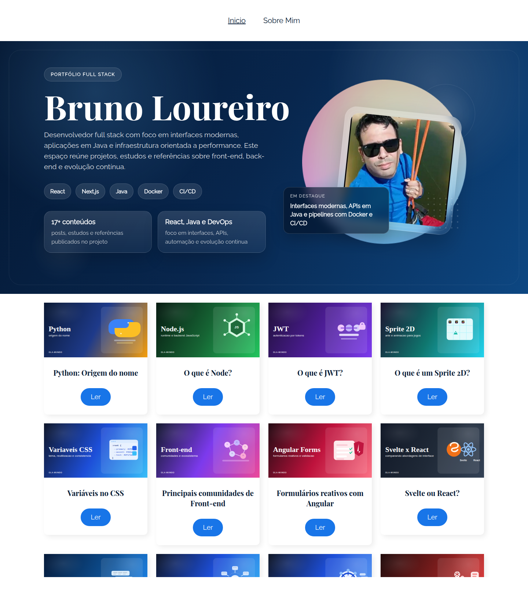
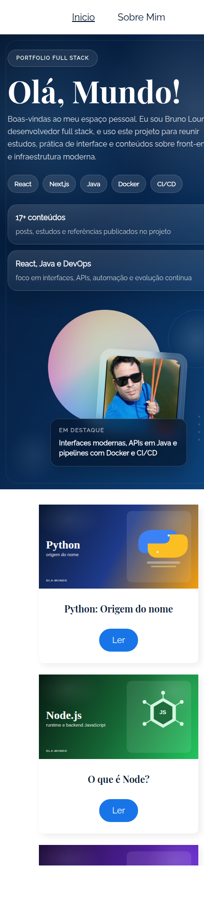

# Bruno Loureiro | Portfólio Full Stack

<p align="center">
  <a href="https://glittering-beignet-c7f54e.netlify.app/">Acessar portfólio publicado</a>
</p>

<p align="center">
  
  
  
  
  
</p>

## Sobre o projeto

Este repositório reúne o **portfólio pessoal de Bruno Loureiro**, desenvolvido em **React** e publicado no **Netlify**. A aplicação apresenta uma home com banner de apresentação profissional, listagem de posts em formato de cards ilustrados, página "Sobre Mim" e páginas de detalhe com conteúdo renderizado em Markdown.

Além de funcionar como vitrine profissional, a aplicação demonstra uma estrutura organizada para componentes reutilizáveis, roteamento no cliente e construção de interface responsiva.

## Preview

As imagens abaixo foram capturadas da versão publicada do projeto:

<p align="center">
  
  
</p>

## Funcionalidades

- Banner inicial com apresentação do autor, destaques de stack e métricas do projeto.
- Grid com **17 posts** exibidos em cards com capas ilustradas.
- Navegação entre páginas com **React Router DOM**.
- Renderização dos artigos em **Markdown** com **React Markdown**.
- Sugestão de outros posts ao final da leitura.
- Layout responsivo para desktop e mobile.

## Tecnologias usadas neste projeto

### Front-end

- React 18
- JavaScript
- CSS Modules
- React Router DOM
- React Markdown

### Ferramentas e deploy

- Create React App
- npm
- Netlify

## Conhecimentos complementares

Além das tecnologias usadas neste projeto, este README também destaca conhecimentos complementares do autor:

<p>
  
  
  
  
  
  
  
  
  
  
</p>

## Estrutura do projeto

- `src/componentes`: componentes reutilizáveis da interface.
- `src/paginas`: páginas principais da aplicação.
- `src/json/posts.json`: base local com os conteúdos dos posts.
- `public/assets/posts`: imagens de capa utilizadas nos cards e posts.
- `docs/images`: screenshots usadas neste README.

## Como executar localmente

1. Clone o repositório:

   ```bash
   git clone https://github.com/LoureiroBruno/LoureiroBruno.git
   ```

2. Acesse a pasta do projeto:

   ```bash
   cd LoureiroBruno
   ```

3. Instale as dependências:

   ```bash
   npm install
   ```

4. Inicie o ambiente de desenvolvimento:

   ```bash
   npm start
   ```

5. Abra `http://localhost:3000` no navegador.

## Deploy

Projeto publicado em:

- https://glittering-beignet-c7f54e.netlify.app/

Para deploys no Netlify com **React Router**, o repositório já inclui o fallback de SPA via arquivo `_redirects`.
